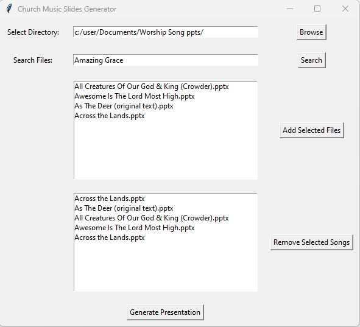

# Worship Music Slides Generator

### Background:

This app was created with the aid of ChatGPT to automate the creation of music slides for Sunday worship services at church. All of the song lyrics are stored as individual files in a folder (SONG LYRICS) within sub directories by alphabet. _Note the songs lyrics were provided upon purchase of an annual license to be able to play the songs during church services; some of the items are in the public domain now._

However... I suppose this app can also be used in other scenarios as well.

### Function:

This app allows the user to search for song lyric Power Point presentations by title within a specified directory (and child directories). The user can then add the songs to a list and once all the desired songs are added, they can concatenate it into one presentation.

### Input variables:

- **Select Directory:** Enter the file path to the lyrics directory or click the “Browse” button to navigate to the directory containing the lyrics slides.

- **Search Files:** Type the file name (or song name if the files are titled accordingly) of the song you want to add choose. You can hit enter or click “Search” to execute the search. The search is performed using Python’s **fuzzywuzzy** package which compares the search key word to the file names in the specified directory and performs approximate string matching and returns the top 10 results with the highest Levenshtein distance scores.

- **Add Selected Files:** You can click on the file that you would like to add and click the “Add Selected Files” button to add them to the list of songs. Alternatively, you can double click on the item to add it to the list. _Note if the file with the same name is added multiple times, the user will be prompted with a messaged notifying them as such and the user can click yes if they want to add it anyways or no if that was not the intention._

- ** List Box (Lower):** This is where all the selected songs will be displayed. You can click and drag the song names to reorder the them as desired or you can remove a selected song by clicking the **“Remove Selected Songs”** button after selecting a song.

- **Generate Presentation:** This will concatenate the selected files into one file and format it accordingly. It will then prompt the user to save the file in the desired location.

### App Layout:

